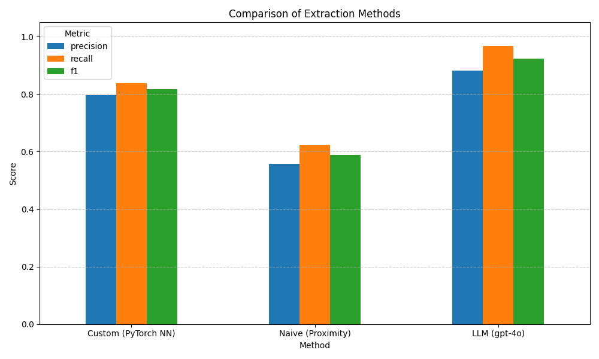

# Pituitary Adenoma Relation Extraction Experimentation

This project compares various methods for extracting relationships between diagnoses and dates in clinical notes of patients with Pituitary Adenoma. The aim is to use the extracted date-diagnosis pairs to construct a patient timeline, and input this into the Foresight model to see whether it would have predicted the patient's Pituitary Adenoma diganosis or not.

There are three main features implemented in this repository:
1. **Synthetic data generation** using `synthetic_data_generator.py`.
2. **Custom model training** using `train.py` and `training_utils.py`.
3. **Comparison of various relation extraction methods and their performance** on the synthetic data. The methods are implemented by the modules in the extractors folder and various utility functions in `extraction_utils.py`. Users can define their experiment in `config.py` and then run the pipeline via `main.py`.

Three methods are compared to do the relationship extraction:

1. **Naive (Proximity)** approach that relates diagnoses to their closest dates in the text. See `naive_extractor.py`.
2. **Custom Neural Network** approach using a PyTorch implementation. See `custom_extractor.py` and `DiagnosisDateRelationModel.py` for the model architecture.
3. **LLM** approach using GPT4o via the OpenAI API. See `llm_extractor.py`.

I also intend to test **RelCAT** as a fourth method.

## Usage

### 1. Get Started

1. Clone the repository
2. Create a virtual environment and install dependencies in requirements.txt
3. Configure API Keys and model paths (if needed):

For LLM (OpenAI) support, create a .env file in the root of the repository and set an `OPENAI_API_KEY` variable.
```bash
OPENAI_API_KEY = ''  # Set OPENAI_API_KEY here
```

### 2. Configure the Experiment

Edit `config.py` to set:

*   `RUN_MODE`: Choose the operation mode:
    *   `'single'`: Run on the sample note (`data/sample_note.py`).
    *   `'evaluate'`: Evaluate a single method on the dataset set in `DATASET_PATH`.
    *   `'compare'`: Compare all available methods on the dataset set in `DATASET_PATH`.
*   `EXTRACTION_METHOD`: Choose the method to use for `'single'` or `'evaluate'` mode (the options are: `'naive'`, `'custom'`, `'relcat'`, `'llm'`).
*   `DATASET_PATH`: Path to the dataset file (used in `'evaluate'` and `'compare'` modes).
*   Method-specific parameters (e.g., `PROXIMITY_MAX_DISTANCE`, `OPENAI_MODEL`).
*   Prediction processing parameters (`PREDICTION_MAX_DISTANCE`, `PREDICTION_MAX_CONTEXT_LEN`).

### 3. Run the Experiment

Execute the configured experiment:
```bash
python main.py
```

*   If `RUN_MODE` is `'single'`, it will print the extracted tuples for the chosen `EXTRACTION_METHOD` for the sample clinical note.
*   If `RUN_MODE` is `'evaluate'`, it will print evaluation metrics for the chosen `EXTRACTION_METHOD` for the dataset specified in `DATASET_PATH` and save plots to `experiment_outputs/`.
*   If `RUN_MODE` is `'compare'`, it will print comparison metrics for all available methods and save plots to `experiment_outputs/`.

## Initial Results

Performance comparison of the three extraction methods on the synthetic dataset (test set):

| Method                | Precision | Recall | F1    |
|----------------------|-----------|--------|-------|
| Custom (PyTorch NN)  | 0.796     | 0.839  | 0.817 |
| Naive (Proximity)    | 0.558     | 0.624  | 0.589 |
| LLM (gpt-4o)         | 0.882     | 0.968  | 0.923 |



## Further Usage

### Training the Custom Neural Network Model (Optional)

If you want to use or retrain the `'custom'` method:

Edit `model_training/training_config.py` to set:
*   Training hyperparameters (`LEARNING_RATE`, `NUM_EPOCHS`, `BATCH_SIZE`).
*   Model architecture (`EMBEDDING_DIM`, `HIDDEN_DIM`).
*   Training data processing (`MAX_DISTANCE`, `MAX_CONTEXT_LEN`).
*   Dataset generation setting (`NUM_SAMPLES`).

Then run:
```bash
python model_training/train.py
```
This saves `best_model.pt` and `vocab.pt` to `model_training/`.


