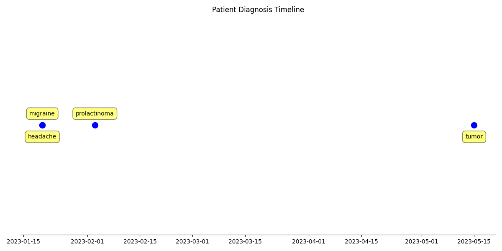

# Pituitary Adenoma Relation Extraction & Prediction Project

This project compares various methods for extracting relationships between diagnoses and dates in clinical notes of patients with Pituitary Adenoma. The aim is to use the extracted date-diagnosis pairs to construct a patient timeline, and input this into the Foresight model to see whether it would have predicted the patient's Pituitary Adenoma diganosis or not.

There are two main features implemented in this repository:
1. **Custom model training** using `train.py` and `training_utils.py`.
2. **Comparison of various relation extraction methods and their performance**. The methods are implemented by the modules in the extractors folder and various utility functions in `extraction_utils.py`. Users can define their experiment in `config.py` and then run the pipeline via `main.py`.

Four methods are compared to do the relationship extraction:

1. **Naive (Proximity)** approach that relates diagnoses to their closest dates in the text. See `naive_extractor.py`.
2. **Custom Neural Network** approach using a PyTorch implementation. See `custom_extractor.py` and `DiagnosisDateRelationModel.py` for the model architecture.
3. **OpenAI** approach using GPT4o via the OpenAI API. See `openai_extractor.py`.
4. **Llama** approach using local Llama-3.2-3B-Instruct model via Hugging Face Transformers. See `llama_extractor.py`.

In the future the plan is to extend the functionality using **RelCAT** as a fifth method.

## Usage

### 1. Get Started

1. Clone the repository
2. Create a virtual environment and install dependencies in requirements.txt
3. Configure API Keys and model paths (if needed):

For LLM (OpenAI) support, create a .env file in the root of the repository and set an `OPENAI_API_KEY` variable. Note that OpenAI models should only be used with synthetic data.
```bash
OPENAI_API_KEY = ''  # Set OPENAI_API_KEY here
```

For Llama-3.2 support, ensure you have the model downloaded in the specified path (see config.py) and that you have access to the model via HuggingFace. The model can be downloaded from: https://huggingface.co/meta-llama/Llama-3.2-3B-Instruct.

### 2. Data Format Requirements

The system expects CSV files with pre-extracted entities and dates. See `data/sample.csv` and `data/synthetic.csv` for examples.

**Required columns:**
- `patient`: Patient ID
- `note_id`: Unique note identifier  
- `note`: Clinical note text
- `document_timestamp`: Document date (YYYY-MM-DD)
- `extracted_disorders`: JSON array of disorder entities with positions
- `formatted_dates`: JSON array of dates (original and YYYY-MM-DD parsed format) with positions
- `gold_standard`: JSON array of correct diagnosis-date relationships for evaluation

### 3. Configure the Experiment

Edit `config.py` to set:

*   `RUN_MODE`: Choose the operation mode:
    *   `'evaluate'`: Evaluate a single method on the dataset set in `DATA_SOURCE`.
    *   `'compare'`: Compare all available methods on the dataset set in `DATA_SOURCE`.
*   `EXTRACTION_METHOD`: Choose the method to use for `'evaluate'` mode (the options are: `'naive'`, `'custom'`, `'openai'`, `'llama'`).
*   `DATA_SOURCE`: Choose the data source (`'imaging'`, `'notes'`, `'letters'`, `'sample'`, `'synthetic'`).
*   `ENABLE_RELATIVE_DATE_EXTRACTION`: Extract relative dates like "3 months ago" (default: True)
*   `GENERATE_PATIENT_TIMELINES`: Generate timeline visualizations (default: True)
*   Column names can be customized using `REAL_DATA_*_COLUMN` variables

### 4. Run the Experiment

Execute the configured experiment:
```bash
python main.py
```

*   If `RUN_MODE` is `'evaluate'`, it will print evaluation metrics for the chosen `EXTRACTION_METHOD` for the dataset specified by `DATA_SOURCE` and save plots to `experiment_outputs/`.
*   If `RUN_MODE` is `'compare'`, it will print comparison metrics for all available methods and save plots to `experiment_outputs/`.

## Initial Results

Performance comparison of the three extraction methods on the synthetic dataset (test set):

| Method                | Precision | Recall | F1    |
|----------------------|-----------|--------|-------|
| Custom (PyTorch NN)  | 0.796     | 0.839  | 0.817 |
| Naive (Proximity)    | 0.558     | 0.624  | 0.589 |
| OpenAI (gpt-4o)      | 0.882     | 0.968  | 0.923 |


Example patient timeline:



## Further Usage

### Training the Custom Neural Network Model (Optional)

If you want to use or retrain the `'custom'` method:

Edit `model_training/training_config.py` to set:
*   Training hyperparameters (`LEARNING_RATE`, `NUM_EPOCHS`, `BATCH_SIZE`).
*   Model architecture (`EMBEDDING_DIM`, `HIDDEN_DIM`).
*   Training data processing (`MAX_DISTANCE`, `MAX_CONTEXT_LEN`).
*   Dataset generation setting (`NUM_SAMPLES`).

Then run:
```bash
python model_training/train.py
```
This saves `best_model.pt` and `vocab.pt` to `model_training/`.


